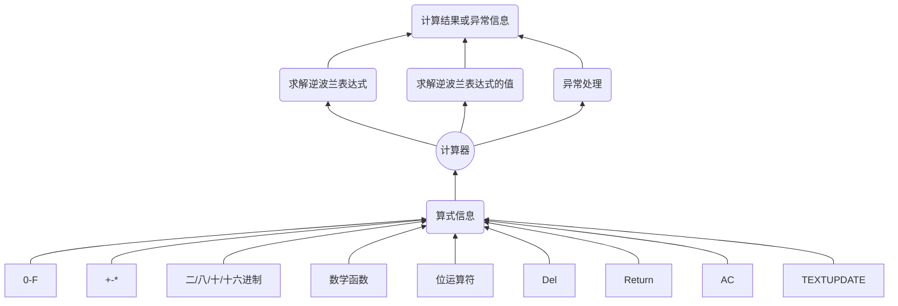

# SimpleMFCCalculator


------

## 设计文档

### 设计任务

> **用VC6.0设计一个MFC对话框计算器，要求至少具有如下功能：**

* 处理一个包含有加减乘除和括号的十进制算式并输出计算结果
* 用户容错恢复操作，自定义输入和报错功能
* 进制转换和不同进制下的运算
* 数学函数运算

### 任务分析

* 如何将一个运算表达式变成可以用于计算机计算的表达式形式？
* 如何处理进制发生改变时产生的影响？
* 如何将MFC中的表达式传进计算器内核库中？ 
* 如何传递进制信息到计算器内核库中？

### 设计思路与流程

> **设计思路**

1. 设计计算器对话框界面，包含有基本的0-9,A-F,+-*/,(),转换进制的单选按钮以及sin,cos,tan,asin,acos,atan这些操作所需的按钮,并设置对应的功能。
2. 设计计算器内核库，包含有求解逆波兰表达式、判断数字、计算逆波兰表达式的值的诸多功能，将求解逆波兰表达式和计算逆波兰表达式的值两部分封装在一个操作函数中，并配置异常处理功能，提示各种算式可能出现的问题。
3. 设计不同类型异常处理的常量数组，用于提示各种类型的异常问题。
4. 添加进制设置，记录当前运算进制，并在当前进制下进行求解逆波兰表达式和求值的操作。
5. 提供多种接口，在计算器类实例化的时候，可以直接通过CString和进制来实例化计算器，也可以直接通过string和进制来实例化计算器。

> **功能关系设计图**




## 功能介绍

1. 算式信息的输入:

   包括数值信息的输入0-F、运算符的输入、括号的输入、进制的选取和数学函数的输入，其中数学函数的输入和一般计算器的输入设计相似，添加相关函数和左括号，右括号需要完成函数自变量的填写后再添加。

2. 计算器算式计算功能:
   在将算式和进制数传入计算器类中实例化之后，先将计算器算式转换为逆波兰表达式，将数字和运算符分割开来存储，在计算逆波兰表达式的值的时候将数值字符串按照对应进制转换为十进制数字存储在计算结果的容器中，一步步完成算式值的计算。

3. 异常处理：

   在进行逆波兰表达式的求解和计算逆波兰表达式的值的时候会出现诸多异常，例如左右括号不匹配，对应进制下出现不合法字符，出现连续的运算符，小数点设置不合法等等，在这些问题可能发生的地方进行异常判断，如果确实会出现对应的异常情况，那么会抛出异常，在外层封装的操作函数中进行异常处理并在输出结果的时候显示异常信息。

4. 进制转换功能：

   进制功能尚有欠缺，仅支持统一进制下的计算，支持合法输入，输出对应进制下结果，**不支持一个数的进制转换**，最好在文本框为空的时候转换进制。

## 文件和对象描述

* 计算器内核的函数设置：

```c++
public:
	calculator(string&a,int base);//初始化计算器
    calculator(CString&a,int base):infix(a.GetBuffer(a.GetLength()));//初始化计算器
	void setinfix(string);//设置中缀表达式
	string getinfix();    //获取
	void setanswer(double=0);//设置答案
	CString getanswer();//获取答案
    void setisexception(int=0);//isexception设置函数
    int getisexception();//isexception取值函数
    double turnnumber(string);//转换数字

	bool isnumber(char);//判断是否为数字
	int priority(char);//运算符优先级函数

    void setsuffix();//求逆波兰表达式
	void calculate();//求解逆波兰表达式的值
	void operate();//求逆波兰表达式并求值
	void modify();//计算结果进制转换
    static const string iexcept[5];//静态常量异常类型
	static const int basenumber[4];//静态基数

private:
  string infix;//存储原始计算式
  vector<string>suffix;//存储后缀表达式
  stack<string>operation;//运算符栈
  stack<double>calcul;//计算结果栈
  string ansstring;//答案信息
  int isexception;//判断是否有异常
  double answer;//存储数值结果
  int bas;//基数
```

* TestDlg中负责对话框响应函数的处理:

  //{{AFX_MSG(CTESTDlg)
  virtual BOOL OnInitDialog();
  afx_msg void OnSysCommand(UINT nID, LPARAM lParam);
  afx_msg void OnPaint();
  afx_msg HCURSOR OnQueryDragIcon();
  afx_msg void OnPress1();//添加7
  afx_msg void OnPress2();//添加8
  afx_msg void OnPress3();//添加9
  afx_msg void OnPress4();//添加4
  afx_msg void OnPress5();//添加5
  afx_msg void OnPress6();//添加6
  afx_msg void OnPress7();//添加1
  afx_msg void OnPress8();//添加2
  afx_msg void OnPress9();//添加3
  afx_msg void OnPress10();//添加0
  afx_msg void OnPress11();//添加.
  afx_msg void OnPress12();//=计算算式结果
  afx_msg void OnPress13();//添加+
  afx_msg void OnPress14();//添加-
  afx_msg void OnPress15();//添加*
  afx_msg void OnPress16();//添加/
  afx_msg void OnPress17();//添加AC
  afx_msg void OnPress18();//添加{
  afx_msg void OnPress19();//添加}
  afx_msg void OnPress20();//添加Del
  afx_msg void OnPress21();//添加&
  afx_msg void OnPress22();//添加^
  afx_msg void OnPress23();//添加|
  afx_msg void OnPress24();//Return返回上一个算式
  afx_msg void OnPress25();//TEXT UPDATE将文本输入内容更新到算式中 
  afx_msg void OnPress26();//sin添加sin(
  afx_msg void OnPress27();//cos添加cos(
  afx_msg void OnPress28();//tan添加tan(
  afx_msg void OnPress29();//asin添加asin(
  afx_msg void OnPress30();//acos添加acos(
  afx_msg void OnPress31();//atan添加atan(
  afx_msg void OnRadio1();//进制选择同时完成对应进制下的计算
  afx_msg void OnPress32();//添加A
  afx_msg void OnPress33();//添加B
  afx_msg void OnPress34();//添加C
  afx_msg void OnPress35();//添加D
  afx_msg void OnPress36();//添加E
  afx_msg void OnPress37();//添加F
  //}}AFX_MSG
## 测试报告

* 主要通过不同进制下的运算结果来进行测试：

  十进制算式:

  

  运算结果:

  

二进制算式：


运算结果：


十六进制算式：


运算结果：


八进制算式:


运算结果：


三角函数算式：


运算结果:


异常：


## 总结

​	总体来说，MFC对话框计算器应用程序并没有用到太多MFC层的知识，主体还是在于计算器功能的实现。在实现计算器功能的时候本身进行转换计算的过程并不是难点，主要在于可能出现的不合法情形，诸如括号问题、小数点不合法、除以零等等以及可能出现的未知逻辑错误，当然进制转换也是一个相对比较复杂的问题，由于没有找到合适的实数进制转换的系统函数，自己手动编写了一个转换函数，虽然可行，但是在大大降低了代码的可读性和简洁性。最后，再三角函数的处理上仍有一些不足，虽然一开始的计算并不会出错，但有时会出现三角函数的计算明显超出了取值范围这种未知错，所以还有许多需要发现并改进的细节，开发的过程便是如此。


